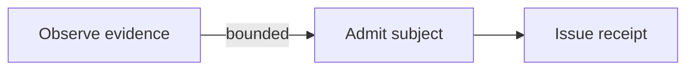

# Flowchart Semantic Crown

## Purpose

This is the first executable thesis slice for Mermaid as a universal I/O surface. It does not claim that Mermaid is a universal semantic kernel.

```text
Mermaid text
→ bounded profile parser
→ typed admission or refusal
→ canonical graph
→ deterministic lowering
→ independent lifting
→ semantic comparison
→ receipt
→ replay
```

The module has no actuation authority. It parses and constructs representations only.

## Admitted profile

Profile identity:

```text
mmdio.flowchart.rectangle-solid/1
```

Supported syntax:



The profile admits:

- `flowchart` or `graph` headers;
- `TD`, `TB`, `T`, `BT`, `LR`, and `RL` directions;
- explicitly declared rectangle nodes with JSON-style quoted labels;
- solid directed edges with optional pipe-delimited labels;
- blank lines and `%%` comments.

Direction aliases `T`, `TB`, and `TD` normalize to `TD`. Nodes and edges are sorted canonically, so semantically equal source ordering produces the same graph and rendered bytes.

## Typed refusals

| Code | Boundary |
|---|---|
| `MMDIO-FLOW-001` | empty input |
| `MMDIO-FLOW-002` | missing or unsupported header |
| `MMDIO-FLOW-003` | syntax outside the bounded profile |
| `MMDIO-FLOW-004` | duplicate node identity |
| `MMDIO-FLOW-005` | edge references an undeclared node |
| `MMDIO-FLOW-006` | duplicate edge |
| `MMDIO-FLOW-007` | empty label |
| `MMDIO-FLOW-008` | receipt or projection tampering |
| `MMDIO-FLOW-009` | malformed receipt carrier |

Unsupported Mermaid constructs are not silently discarded or approximated.

## Receipt law

`mmdio.flowchart-crown-receipt/1` binds:

- original input SHA-256;
- canonical graph SHA-256;
- canonical Mermaid rendering SHA-256;
- exact canonical graph;
- exact rendered text;
- parse/admission/lower/lift/comparison state;
- replay result;
- evidence axes;
- the claim ceiling `BOUNDED_FLOWCHART_SEMANTIC_ROUNDTRIP_ONLY`.

The independent verifier recomputes the receipt digest, graph digest, rendered digest, canonical lowering, and lifted graph.

## Replay

```bash
PYTHONPATH=src python3 scripts/flowchart_crown.py input.mmd \
  --receipt /tmp/receipt.json \
  --rendered /tmp/canonical.mmd

PYTHONPATH=src python3 scripts/flowchart_crown.py \
  --receipt /tmp/receipt.json \
  --verify
```

The exact-head workflow executes the crown twice, compares receipt bytes, runs mutation/refusal tests, and asks the pinned Mermaid JavaScript runtime to render the canonical projection.

## Exclusions

This crown does not establish:

- semantic equivalence for the other Mermaid dialects;
- arbitrary shapes, subgraphs, styles, classes, links, callbacks, or directives;
- browser editor or collaboration standing;
- graph-to-machine actuation;
- correctness of generated multi-dialect projections;
- aggregate `mmdio` release standing.
