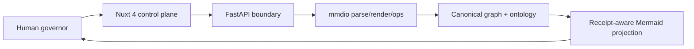

# Frontend consolidation: one mmdio control plane

## Decision

The canonical web runtime is **Nuxt 4 under `web/` inside `seanchatmangpt/mmdio`**.

This is a consolidation, not a repository landfill. Existing Next.js and Nuxt repositories remain immutable provenance sources. Reusable capabilities are admitted into one control plane; incompatible runtimes, tutorials, duplicate templates, and misleadingly named repositories are classified rather than copied.

## Why Nuxt won

The strongest current application surface is `neako-web`: Nuxt 4, Nuxt UI 4, graph-oriented packages, and an extensive test ladder. `nuxt-ai-chatbot` supplies the prior Mermaid/editor direction. `nuxt-ui` supplies the visual system. `nuxt-open-fetch` is the eventual typed client boundary once the FastAPI OpenAPI schema stabilizes.

The Next.js estate contains useful dashboard and information-architecture precedents, but the confirmed applications are older Next 13/14 React surfaces. Running Next and Nuxt together would preserve framework fragmentation rather than compile it away.

## Admitted architecture

The first slice provides:

- a Nuxt 4 application shell;
- Nuxt UI components;
- a client-side Mermaid 11.16 workbench;
- a bounded FastAPI diagram-type detection endpoint;
- explicit separation between candidate representation and execution authority;
- a machine-readable source/admission ledger in `frontend-sources.json`.

## Source disposition

| Source class | Disposition |
| --- | --- |
| Modern Nuxt applications | Extract capabilities and tests into `web/` |
| Nuxt modules | Depend on the published module or admit source later |
| Nuxt UI Pro templates | Reference route archetypes; do not copy source in this slice |
| Next.js applications | Translate information architecture; do not retain a second runtime |
| Boilerplates/tutorials | Superseded |
| Duplicate manifests | Deduplicated by blob identity |
| False-positive names | Excluded with evidence |

## Next migration batches

1. **Workbench** — add Monaco, diagram tabs, parse/validate/diff/merge API operations, and typed refusal rendering.
2. **Institutional views** — consolidate dashboard, documentation, and public narrative routes.
3. **Typed transport** — admit `nuxt-open-fetch` after the OpenAPI contract has stable schema fixtures.
4. **Graph navigation** — extract the graph/globe/semantic-zoom capabilities from `neako-web` behind mmdio graph types.
5. **Verification** — manufacture a lockfile, run Nuxt typecheck/build, add browser tests, and connect exact-head CI.

## Standing

`PARTIAL_ALIVE`:

- **Observed:** repository inventory, manifests, framework versions, and destination base commit.
- **Constructed:** one coherent Nuxt 4 + FastAPI vertical slice.
- **Statically verified:** JSON parse, Python compile, API source contract, and TypeScript source syntax.
- **Not executed:** Nuxt dependency resolution and production build, because the working container could not access GitHub/npm and no destination checkout was materialized.

The crown advances to `ALIVE` only after the exact branch installs, typechecks, builds, launches, renders the starter diagram, and receives a successful response from `/api/v1/diagrams/detect`.
