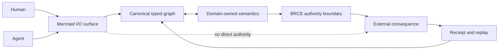
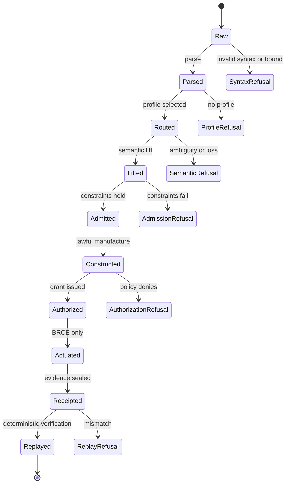
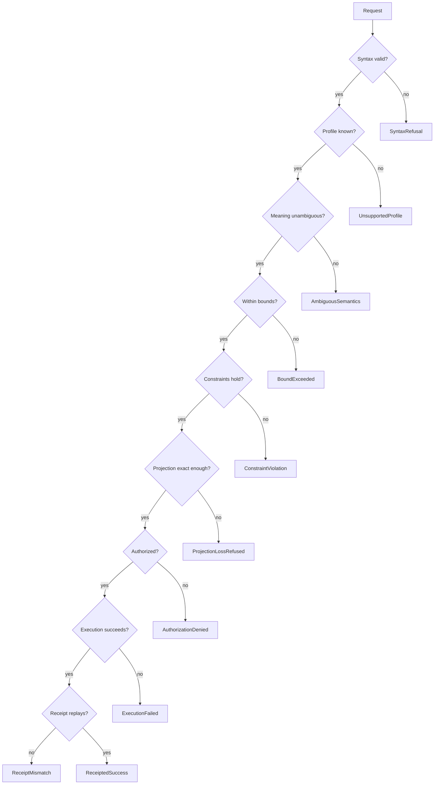
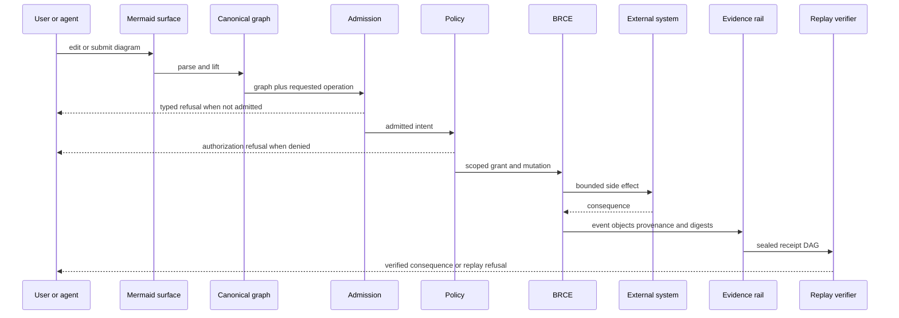
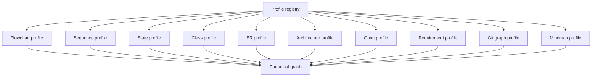
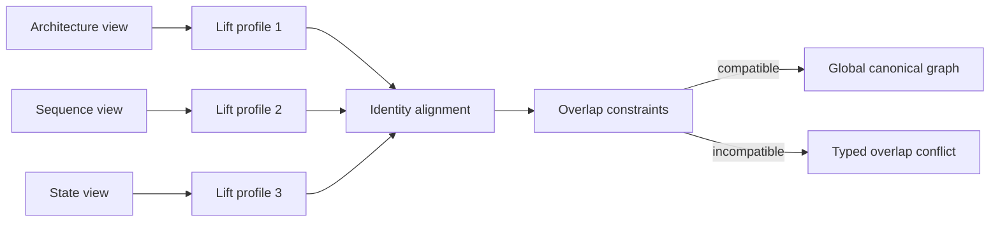
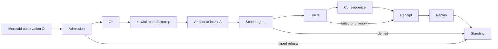

# Mermaid as Universal I/O

## A Receipt-Bearing Graph Interface for Heterogeneous Computational Systems

**Author:** Sean Chatman  
**Repository:** `seanchatmangpt/mmdio`  
**Repository base:** `c0c21bc47c951379dfc192d40b0dbe12797d3581`  
**Manuscript date:** 1 August 2026  
**Document class:** PhD thesis manuscript and executable research specification  
**Empirical standing:** `PARTIAL_ALIVE`  

---

## Abstract

Software systems expose their state and accept change through a fragmented collection of
interfaces: graphical dashboards, forms, command lines, APIs, configuration files, database
schemas, workflow notations, architecture diagrams, tickets, and natural-language prompts.
Each interface captures only part of the underlying system. The resulting translations are
usually informal, lossy, difficult to version, and weakly connected to execution evidence.
This dissertation asks whether Mermaid, a plain-text family of diagram languages, can be
reframed as a universal input/output surface for heterogeneous computational systems.

The thesis does **not** claim that Mermaid syntax is a universal semantic foundation, that every
domain can be encoded without loss, or that a diagram carries execution authority. The central
claim is narrower and stronger: for a bounded domain whose admitted objects can be represented
as typed attributed graphs, Mermaid can serve as a universal, human-legible, versionable I/O
surface when it is mediated by explicit domain profiles, a canonical graph intermediate
representation, typed admission, lawful construction, brokered actuation, receipts, and replay.
The universal property belongs to the interface architecture, not to the diagram grammar alone.

The dissertation introduces the **Mermaid Universal I/O calculus**. A Mermaid document is first
an observation candidate, `O`. Parsing, identity resolution, semantic lifting, profile checks,
constraints, policy, and finite bounds manufacture an admitted observation, `O*`. Lawful
construction then produces an artifact, `A = μ(O*)`. Any external consequence is issued only
through the Brokered Receipted Consequence Engine (BRCE), under the invariant of zero
unreceipted actuation. The resulting event and object relations are recorded as object-centric
evidence, sealed into a content-addressed receipt, and made available for deterministic replay.

The work contributes: (1) a formal distinction between universal surface and universal
semantics; (2) a profile-indexed lifting and lowering calculus between Mermaid dialects and
canonical graphs; (3) round-trip, identity, authority, and receipt laws; (4) a typed refusal
algebra for unsupported, ambiguous, unbounded, unauthorized, and unreplayable operations;
(5) an architecture for the `mmdio` Python, CLI, REST, and documentation system; and (6) an
executable evaluation protocol that prevents proposed behavior from being misreported as
observed implementation. The current repository proves only the application scaffold. The
semantic engine, dialect adapters, admission gates, broker, and replay verifier remain proposed
until the exact acceptance commands produce reproducible receipts.

**Keywords:** Mermaid, universal I/O, diagrams as code, bidirectional transformation, canonical
graph, domain-specific language, semantic projection, admission, provenance, receipts, replay,
object-centric event logs, BRCE, Chatman Equation.

---

## Thesis standing and claim ledger

This manuscript separates what is observed from what is proposed.

| Claim | Standing | Basis |
|---|---|---|
| The repository identifies the project as “Mermaid Diagrams as Universal IO.” | `ALIVE` | Observed in the repository metadata, README, and package configuration at the exact base commit. |
| The repository provides Python 3.13 packaging, a Typer CLI entry point, FastAPI support, MkDocs, tests, and CI scaffolding. | `ALIVE` | Observed files and configuration at the exact base commit. |
| The current CLI or API parses Mermaid into a canonical graph. | `UNSUPPORTED` | No such implementation exists at the exact base commit. |
| Mermaid can be a universal I/O surface over registered bounded graph domains. | `PROPOSED` | Formal result subject to the definitions and boundary conditions in Chapters 3–6. |
| Mermaid itself is a universal semantic language. | `REFUSED_OVERCLAIM` | Different Mermaid dialects have different semantics, and some domain information is not representable without an extension envelope. |
| A Mermaid diagram may directly actuate tools or external systems. | `REFUSED_AUTHORITY_LEAK` | The thesis requires BRCE as the only lawful `DO` path. |
| The full architecture is empirically validated. | `PARTIAL_ALIVE` | The evaluation protocol is specified; the implementation and receipts are not yet present. |

The strongest current statement is therefore:

> `mmdio` is an initialized research artifact with an admitted architectural thesis and an
> executable validation plan. It is not yet a validated universal I/O implementation.

---

## Contents

1. Introduction
2. Foundations and definitions
3. The Mermaid Universal I/O calculus
4. System architecture
5. Mermaid dialects as profile-indexed views
6. Bidirectional editing, normalization, and composition
7. Authority, actuation, receipts, and replay
8. Implementation architecture for `mmdio`
9. Evaluation protocol and falsifiers
10. Related work
11. Limitations, ethics, and governance
12. Conclusion
13. Appendices
14. References

---

# 1. Introduction

## 1.1 The interface fragmentation problem

A contemporary software system rarely has one input or one output. A user may describe a goal
in natural language, inspect a dashboard, change a configuration file, approve a ticket, call an
API, execute a command, review a pull request, and later inspect an audit log. These surfaces are
not merely different visualizations of the same state. They usually contain different identifiers,
constraints, omissions, authority assumptions, and temporal models. A process diagram can show
order but omit authorization. An architecture diagram can show connectivity but omit runtime
state. An API schema can describe admissible fields but omit why a value was selected. A log can
record that something happened without proving that it was authorized or semantically faithful
to the plan that preceded it.

The fragmentation is amplified by artificial intelligence. A model can generate prose, JSON,
code, diagrams, or tool calls, but the generated representation often has no explicit boundary
between suggestion and authority. A visually persuasive graph may be mistaken for a validated
model. A syntactically valid plan may be mistaken for an executable plan. A successful tool call
may be mistaken for proof that the input was complete, the transformation was lawful, or the
consequence can be replayed.

The engineering problem is therefore not simply to invent another interchange format. It is to
construct a common interaction surface that preserves domain distinctions, allows human and
machine editing, remains versionable as text, exposes topology visually, refuses unsupported
claims, and connects any external consequence to inspectable evidence.

Mermaid is a compelling candidate for that surface. Its source is plain text. Its diagram types
cover flow, interaction, state, structure, data relationships, schedules, requirements, source
history, architecture, and other views. Mermaid is rendered in widely used Markdown contexts,
including GitHub. A single artifact can be read as text, reviewed as a diff, rendered as a graph,
and embedded in documentation. These properties reduce the distance between source,
explanation, review, and visualization.

Yet Mermaid alone is insufficient. Diagram labels are not stable identifiers unless the system
makes them so. An arrow in a flowchart does not state whether it represents causality,
precedence, data dependency, authorization, reachability, or mere visual association. Layout is
not semantics. Different diagram types have different grammars and semantic commitments.
Extensions, directives, click handlers, and rendered HTML create security concerns. Some source
domains contain constraints that cannot be expressed in ordinary Mermaid syntax. A universal
I/O claim must therefore be constructed around Mermaid, not projected onto Mermaid by rhetoric.

## 1.2 Research question

The primary research question is:

> Under what conditions can Mermaid function as a universal input/output surface for bounded
> heterogeneous computational domains without becoming the canonical semantic store or an
> ambient source of execution authority?

This question decomposes into five research questions.

**RQ1 — Representation.** What class of domain objects can be lifted from Mermaid source into a
canonical graph while preserving identity, type, relation, and declared constraints?

**RQ2 — Bidirectionality.** What laws must hold for edits to move from Mermaid to the canonical
graph and back without silent semantic loss?

**RQ3 — Composition.** How can diagrams from different Mermaid dialects share identifiers and
compose into a coherent system view while retaining domain ownership?

**RQ4 — Authority.** How can a diagram request or describe action without acquiring direct
actuation authority?

**RQ5 — Evidence.** What receipt and replay structure is sufficient to connect source, admission,
construction, authorization, consequence, and subsequent observation?

## 1.3 Central thesis

The central thesis is:

> Mermaid is universal as an I/O **surface** for any admitted bounded domain that has a registered,
> semantics-preserving mapping to a typed attributed canonical graph. Universality is conditional
> on explicit profiles, total behavior over the admitted subset, typed refusal outside that subset,
> separation of construction from actuation, and receipts that bind every external consequence to
> its source, authority, and replay procedure.

The word *universal* has a precise meaning here. It does not mean that every object in every
possible domain can be represented by unextended Mermaid. It means that heterogeneous domains
can share one human-facing interaction family because their views are mediated by a common
canonical graph and a registry of lawful morphisms. Unsupported objects remain visible as typed
refusals rather than being silently simplified.

## 1.4 Constitutional order

The architecture follows this order:

```text
PRESERVE → FENCE → CALCULUS → EXCLUSIONS → FALSIFIER → EXTENSION → OPERATIONALIZATION
```

First, each source domain keeps its native objects and semantics. Second, the claim boundary is
stated. Third, mappings and laws are defined. Fourth, prohibited equivalences and authority leaks
are excluded. Fifth, observable falsifiers are specified. Sixth, the system permits registered
extensions. Finally, the work is reduced to commands, fixtures, reports, and receipts.

The operational lifecycle is:

```text
parse → route → admit/refuse → diagnose/repair → construct → authorize → actuate → receipt → replay → standing
```

The exclusive actuation rule is:

```text
zero unreceipted actuation
```

## 1.5 Research contributions

This dissertation makes eight contributions.

1. **Universal-surface theorem.** It defines a bounded universal property for a family of Mermaid
   views over a canonical typed graph.
2. **MUIO calculus.** It introduces objects, mappings, laws, and refusals for parse, lift, admit,
   project, authorize, actuate, receipt, and replay.
3. **Dialect profile registry.** It treats each Mermaid diagram type as a domain profile with
   explicit semantic ownership rather than as interchangeable drawing syntax.
4. **Identity-preserving envelope.** It separates stable semantic identifiers from human labels,
   layout hints, and renderer-specific details.
5. **Authority firewall.** It proves by construction that diagrams, renderers, language models,
   planners, and hooks manufacture observations or intents but cannot issue side effects.
6. **Receipt DAG.** It binds source digest, canonical graph digest, profile, policy, construction,
   authorization, consequence, and replay into one inspectable evidence graph.
7. **`mmdio` reference architecture.** It maps the theory into the repository’s Python 3.13,
   Typer, FastAPI, MkDocs, test, and CI surfaces.
8. **Adversarial evaluation protocol.** It defines positive, negative, metamorphic, differential,
   security, accessibility, replay, and chaos tests with evidence-capped standing.

## 1.6 Scope

The thesis covers textual Mermaid source, its parsing and rendering context, canonical graph
intermediation, domain profiles, versioned edits, semantic validation, authorization boundaries,
object-centric evidence, and deterministic replay.

It does not claim to replace RDF, SHACL, PROV-O, OCEL, PDDL, POWL, UML, BPMN, source code,
databases, theorem provers, or domain-specific models. Those systems retain semantic ownership.
Mermaid is the common I/O membrane through which selected aspects are observed and changed.



---

# 2. Foundations and definitions

## 2.1 Diagram source as a first-class artifact

A static diagram image is primarily an output. Its pixels can communicate structure, but they do
not necessarily preserve stable identifiers, edge types, source order, or editing intent. Mermaid
changes the artifact class: the primary object is a text definition, and the visual diagram is a
projection. Text can be stored in Git, compared, reviewed, generated, signed, searched, embedded,
and reconstructed.

This shift resembles the broader “docs as code” movement, but the thesis requires more than
source control. The source must be parseable into semantic objects; transformations must be
bounded; and rendered output must not be confused with canonical meaning. The renderer is one
consumer of the source, not the source of truth.

## 2.2 Universal I/O versus universal semantics

A universal semantic language would need to faithfully define the meaning of every participating
domain. This is neither plausible nor desirable. Planning, process geometry, data constraints,
architecture topology, temporal schedules, proofs, and authorization have different native
objects and laws. Flattening them into one weak graph would erase the distinctions required for
correct execution.

A universal I/O surface has a different obligation. It must provide a common way to present,
inspect, edit, diff, and route domain objects while delegating semantic judgment to registered
profiles and canonical domain models. A web browser is not the semantics of every document it
displays. A terminal is not the semantics of every program it launches. Similarly, Mermaid need
not own every semantic domain to be the common interaction surface.

The thesis uses three layers:

1. **Surface syntax:** Mermaid text, comments, front matter, labels, styles, and layout hints.
2. **Canonical graph:** stable identifiers, typed nodes, typed edges, attributes, provenance,
   constraints, profile identity, and digests.
3. **Domain semantics:** the native model and verifier that determine what the graph means and
   what operations are supported.

## 2.3 Typed attributed graph

Let a canonical graph be:

```text
G = (V, E, s, t, τV, τE, α, ι, P)
```

where:

- `V` is a finite set of nodes;
- `E` is a finite set of edges;
- `s, t : E → V` assign source and target;
- `τV` assigns node types;
- `τE` assigns edge types;
- `α` assigns typed attributes;
- `ι` assigns stable identities;
- `P` records provenance and profile membership.

The graph is finite because actuation and replay require declared bounds. The mathematical source
domain may be larger, but an executable profile admits only a bounded subdomain. A refusal due to
an executable bound is not equivalent to a claim that the underlying domain object is meaningless.

## 2.4 Domain profile

A domain profile is:

```text
D = (name, version, syntax, vocabulary, constraints, lift, lower, verifier, bounds, policy)
```

The profile names the Mermaid dialect or extension it accepts, the canonical types it owns, its
lifting and lowering functions, semantic verifier, finite bounds, security policy, and typed
refusals. Profiles are versioned because Mermaid grammars and domain models evolve.

A profile distinguishes four support levels:

- `EXACT`: all declared semantics are preserved;
- `BOUNDED_EXACT`: semantics are preserved within explicit finite bounds;
- `APPROXIMATE`: the projection is useful but loses declared information;
- `UNSUPPORTED`: no lawful mapping is registered.

Approximation is never silently promoted to exactness.

## 2.5 Observation and admission

Raw Mermaid source is an observation candidate, `O`. It may be incomplete, stale, ambiguous,
malicious, or outside the supported profile. Admission manufactures `O*`:

```text
O* = Adm(O; profile, bounds, verifier, policy)
```

`O*` is not “true” in an unlimited metaphysical sense. It is aligned, grounded, bounded, and
admitted for a declared operation. Admission may return a typed refusal with a witness.

## 2.6 Construction and the Chatman Equation

The artifact law is:

```text
A = μ(O*)
```

`μ` is lawful manufacture. In `mmdio`, manufacture may produce a normalized Mermaid document, a
canonical graph, a diff, an API payload, a generated schema, a planner input, an architecture
projection, a validation report, an authorization request, or a receipt. The artifact’s standing
cannot exceed the evidence produced by `μ` and its verifier.

## 2.7 Select, construct, and do

The system separates three operations.

- **SELECT** chooses among already available candidates.
- **CONSTRUCT** manufactures a new candidate or representation.
- **DO** changes external or persistent state.

A renderer constructs SVG. A language model constructs candidate text. A planner constructs a
candidate plan. A human selects or edits. None of these acts is external actuation. `DO` is
reserved for the brokered consequence path.

## 2.8 Bidirectional transformations

The relation between a canonical graph and a Mermaid view resembles a bidirectional
transformation or lens. However, classic lens laws are adapted because multiple Mermaid dialects
are partial views and may omit canonical information.

For each profile `D`, define:

```text
liftD  : MermaidD ⇀ GraphD
lowerD : GraphD → MermaidD
```

`liftD` is partial over arbitrary text but total over the admitted subset. `lowerD` is total over
graphs that satisfy the profile’s projection constraints. When a graph contains non-projectable
information, the system must use an extension envelope or return a typed refusal.

## 2.9 Provenance and event evidence

A transformation is not fully described by its final bytes. The system records the entity used,
the activity performed, the agent or authority involved, and the resulting entity. PROV-O offers
a public vocabulary for these relations. OCEL offers an object-centric event model in which one
event can relate to multiple typed objects and relationships can carry qualifiers. These
structures fit a universal I/O system better than a single case identifier because one edit may
involve a diagram, graph, profile, policy, branch, user, tool, and external resource.

## 2.10 Foundational exclusions

The following reductions are prohibited:

- rendered equality is not semantic equality;
- label equality is not identity equality;
- parse success is not admission;
- admission is not authorization;
- a plan is not authority;
- tool success is not source-semantic preservation;
- a log line is not necessarily a receipt;
- a receipt for consequence does not by itself prove that a source projection was lossless;
- round-trip bytes are not required when semantic normalization is declared;
- approximate projection is not exact projection;
- unsupported is not refused-by-policy;
- unknown is not admitted.

---

# 3. The Mermaid Universal I/O calculus

## 3.1 Objects

The calculus contains the following object classes.

- `RawSource`: untrusted Mermaid or Markdown text.
- `ParsedSyntax`: a dialect-specific syntax tree.
- `SurfaceObject`: nodes, edges, labels, directives, notes, styles, and layout hints.
- `CanonicalGraph`: typed attributed graph with stable identities.
- `DomainObject`: an object owned by a registered semantic domain.
- `ConstraintSet`: SHACL shapes, schema rules, invariants, and finite bounds.
- `Intent`: a requested change without execution authority.
- `Plan`: an ordered or partially ordered candidate procedure.
- `Grant`: authority scoped to subject, operation, resource, and time.
- `Capability`: an executable adapter with declared behavior.
- `Mutation`: a proposed external state transition.
- `Artifact`: a manufactured representation or result.
- `Event`: an observed execution occurrence.
- `Receipt`: evidence binding identity, authority, consequence, and replay.
- `Refusal`: a typed negative result with witness.

## 3.2 Morphisms

The principal morphisms are:

```text
parse      : RawSource → ParsedSyntax + SyntaxRefusal
route      : ParsedSyntax → Profile + ProfileRefusal
lift       : ParsedSyntax × Profile → CanonicalGraph + SemanticRefusal
admit      : CanonicalGraph × Constraints → O* + AdmissionRefusal
construct  : O* × Operation → Artifact + ConstructionRefusal
authorize  : Intent × Policy → Grant + AuthorizationRefusal
actuate    : Grant × Capability × Mutation → Consequence + ExecutionRefusal
receipt    : EvidenceSet → Receipt + ReceiptRefusal
replay     : Receipt × Capsule → VerifiedConsequence + ReplayRefusal
lower      : CanonicalGraph × Profile → Mermaid + ProjectionRefusal
```

The `+` symbol denotes a disjoint result type, not a thrown exception that may be ignored.

## 3.3 End-to-end law

The full path is:

```text
O
→ parse
→ route
→ lift
→ admit or refuse
→ O*
→ diagnose and repair
→ construct
→ intent
→ authorize
→ grant
→ BRCE actuate
→ consequence
→ receipt
→ replay
→ standing
```



## 3.4 Identity law

Human labels are mutable presentation. Stable identity must survive label edits, layout changes,
and canonical formatting.

For every admitted node or edge `x`:

```text
identity(lift(lower(x))) = identity(x)
```

unless the operation explicitly creates, deletes, splits, or merges the object. If identity cannot
be recovered unambiguously, the edit is refused or routed to a repair interaction.

A profile may encode identity in one of four ways, in descending preference:

1. native Mermaid identifiers;
2. a profile-defined annotation attached to the source object;
3. a sidecar identity map committed with the source;
4. deterministic derivation from a collision-resistant canonical path, only when rename semantics
   are explicitly declared.

Display labels must never be the sole identity source for mutable systems.

## 3.5 Round-trip laws

Let `≈D` be semantic equivalence under profile `D`.

**Lift-lower law:**

```text
liftD(lowerD(g)) ≈D g
```

for every admitted projectable graph `g`.

**Lower-lift law:**

```text
lowerD(liftD(m)) ≈surface normalizeD(m)
```

for every admitted Mermaid source `m`.

The second law permits canonical formatting. It does not require byte identity unless the profile
advertises byte-preserving mode.

**Normalization idempotence:**

```text
normalizeD(normalizeD(m)) = normalizeD(m)
```

**Diff stability:** unrelated layout or formatting changes must not manufacture semantic changes.

**Loss declaration:** if a graph property is not representable, lowering returns either an
extension envelope containing the property or `ProjectionLossRefused`.

## 3.6 Authority law

No morphism before `actuate` has external side-effect authority.

```text
authority(parse) = ∅
authority(lift) = ∅
authority(admit) = ∅
authority(construct) = ∅
authority(lower) = ∅
authority(render) = ∅
authority(hook) = ∅
authority(actuate) ⊆ grant
```

A clickable Mermaid link is presentation behavior, not a lawful mutation path. In authoritative
contexts, rendering uses strict or sandboxed security settings and disables diagram-defined
callbacks.

## 3.7 Receipt law

Every successful external mutation produces a receipt `R` that binds at least:

```text
R = hash(
  source_identity,
  source_digest,
  profile_identity,
  canonical_graph_digest,
  constraint_digest,
  intent_digest,
  policy_digest,
  grant_identity,
  capability_identity,
  mutation_digest,
  pre_state_digest,
  consequence_digest,
  post_state_digest,
  event_log_digest,
  replay_capsule_identity
)
```

The receipt may be a DAG rather than one flat record. Hashing the final output alone is
insufficient because it does not bind the authority or intermediate semantic commitments.

## 3.8 Standing law

Standing is evidence-capped.

- `UNKNOWN`: not inspected or insufficient evidence.
- `PARTIAL_ALIVE`: some required transitions executed, but closure is incomplete.
- `ALIVE`: observed execution against the exact admitted subject with a reproducible receipt.
- `BLOCKED`: a required dependency, authority, source, or environment is unavailable.
- `BUILD_BROKEN`: the declared construction or verification command fails.
- `UNSUPPORTED`: outside the implemented semantic profile.
- `REFUSED_*`: recognized request rejected for a typed reason.

Inspection is not execution. A workflow file is not a successful workflow run. A passing parser
test is not a passing round-trip or broker test.

## 3.9 Bounded universal-surface theorem

**Theorem 1 — Bounded universal surface.** Let `{Di}` be a finite family of registered domain
profiles. For each profile, let `Ai` be an admitted bounded subset of domain objects representable
as finite typed attributed graphs. Suppose:

1. `liftDi` is total from admitted Mermaid sources to `Ai`;
2. `lowerDi` is total from `Ai` to admitted Mermaid sources;
3. the round-trip laws hold up to declared semantic equivalence;
4. shared identities use a common namespace or an admitted alignment relation;
5. cross-profile composition either preserves all owned semantics or returns typed refusals; and
6. no surface operation carries ambient actuation authority.

Then Mermaid plus the profile registry is a universal I/O surface for the coproduct of the
admitted subsets `{Ai}`: every admitted object has a Mermaid observation, every admitted Mermaid
edit maps to a domain change candidate, and every nonrepresentable request terminates in an
inspectable typed refusal.

**Proof sketch.** Each profile supplies a lawful span between its Mermaid subset and canonical
graph subset. The common canonical graph provides shared identity and composition. Totality over
the admitted subset ensures that every admitted domain object can be lowered and every admitted
surface object can be lifted. Round-trip laws preserve semantics. The refusal codomain closes the
operations outside the admitted subset without inventing values. The authority condition ensures
that universality of observation and construction does not imply universality of execution.
Therefore one surface family covers the admitted coproduct while domain semantics remain owned by
the profiles.

The theorem is conditional. A new domain does not become supported by naming it in a diagram. It
requires a profile, mappings, constraints, verifiers, bounds, and fixtures.

## 3.10 No-authority-leak theorem

**Theorem 2 — No authority leak.** If every external mutation is reachable only through BRCE, and
BRCE requires a valid grant whose subject, capability, resource, operation, and bounds match the
mutation, then no Mermaid source, renderer, parser, model, planner, or hook can independently
cause an external mutation.

**Argument.** All pre-BRCE components produce immutable candidates or intents. Their capability
sets exclude external mutation. The broker verifies the grant before invoking the adapter. Any
alternative side-effect edge violates the architecture and is detectable by dependency analysis,
capability tests, or chaos fixtures. Thus a surface document may request action but cannot own the
`DO` transition.

## 3.11 Replay theorem

**Theorem 3 — Receipt replay.** If construction and actuation are deterministic under an immutable
source, profile, policy, capability, configuration, and bounded environment capsule, then replay
of a valid receipt recomputes the same committed digests and consequence classification.

The theorem does not require the external world to be reset to the historical state. Replay may
run against a simulator, recorded adapter, or pure verifier. When an external service is
nondeterministic, the receipt must record the observed response and the verifier must distinguish
response reproduction from request reconstruction.

## 3.12 Local compatibility and gluing

Large systems are rarely represented in one diagram. Each diagram is a local view over a subset
of the canonical graph. Let `Ui` be the node and edge set visible in one view. Two views are
compatible on an overlap when shared identities, types, and owned attributes agree. A family of
compatible local views may be glued into a global graph. An incompatibility is an obstruction,
not permission to choose one view silently.

Examples of obstructions include:

- one sequence diagram treats `payment` as a service while an architecture diagram treats the
  same identity as a database;
- two state diagrams assign different initial states to the same machine;
- a class diagram declares an association optional while an ER diagram declares the corresponding
  relation mandatory;
- a Gantt view schedules an activity before a prerequisite required by the process view.

The system emits an `OverlapConflict` containing both sources, paths, owners, and repair options.

## 3.13 Typed refusal algebra

Refusals are first-class output objects.



A refusal contains the failed predicate, the subject identity, the profile, available evidence,
and a repair surface when repair is lawful.

---

# 4. System architecture

## 4.1 Architectural overview

The architecture has three rails.

1. **Semantic and manufacturing rail:** parsing, profile routing, canonicalization, constraints,
   admission, diagnosis, repair, planning, and artifact construction.
2. **Authoritative hot rail:** grant verification, bounded adapter execution, and consequence
   classification through BRCE.
3. **Evidence and replay rail:** object-centric event capture, provenance, content-addressed
   receipts, deterministic replay, and standing calculation.

```mermaid
flowchart LR
    subgraph Surface[Mermaid universal I/O surface]
        Source[Mermaid source]
        Editor[Human or agent edit]
        Render[Strict renderer]
    end

    subgraph Semantic[Semantic and manufacturing rail]
        Parse[Parse]
        Route[Route profile]
        Lift[Lift to canonical graph]
        Validate[Constraints and bounds]
        Admit[Admit O*]
        Construct[Construct artifact or intent]
    end

    subgraph Authority[Authoritative hot rail]
        Policy[Policy]
        Grant[Grant]
        BRCE[BRCE sole DO path]
        Adapter[Capability adapter]
        World[External system]
    end

    subgraph Evidence[Evidence and replay rail]
        OCEL[OCEL events and objects]
        Prov[PROV graph]
        Receipt[Content-addressed receipt DAG]
        Replay[Replay verifier]
        Standing[Standing]
    end

    Editor --> Source --> Parse --> Route --> Lift --> Validate --> Admit --> Construct
    Source --> Render
    Construct --> Policy --> Grant --> BRCE --> Adapter --> World
    World --> OCEL --> Prov --> Receipt --> Replay --> Standing
    Replay --> Lift
    Source -. cannot actuate .-> World
```



## 4.2 Surface ingestion

`mmdio` accepts Mermaid from standalone `.mmd` files, Markdown fences, API payloads, standard
input, repository blobs, or editor buffers. The ingestion layer records source identity, bytes,
encoding, line endings, repository coordinates when available, and a digest before parsing.

Markdown extraction is explicit. A file can contain multiple Mermaid fences. Each fence receives
a stable source location and optional profile metadata. The enclosing Markdown remains an entity
in provenance because surrounding prose can state assumptions, ownership, or acceptance criteria.

## 4.3 Parsing and dialect detection

Mermaid diagrams begin with a diagram-type declaration, except where front matter or comments
precede it. Detection must use the Mermaid parser or an equivalent grammar, not a regular
expression that guesses from the first token. Parse success yields a dialect identity and syntax
tree. The exact Mermaid grammar version is part of the profile identity.

Parser behavior is bounded by maximum source size, maximum edges, maximum nodes, maximum nesting,
and maximum parse time. A parser timeout is a typed `ParseBoundExceeded`, not a generic success
with a partial graph.

## 4.4 Profile routing

The router selects a domain profile based on diagram dialect, front matter, namespace declarations,
repository policy, and requested operation. One syntax may have multiple profiles. A flowchart may
represent a business process, a dependency graph, a decision tree, or a build pipeline. The router
must not infer the semantic domain from labels alone when the choice affects constraints or
authority.

Profile metadata may be carried in constrained front matter:

```yaml
---
mmdio:
  profile: process.workflow.v1
  graph: urn:mmdio:order-fulfillment
  mode: bounded-exact
  authority: observe-only
---
```

The front matter is a routing claim. It remains subject to repository policy and profile support.

## 4.5 Canonical graph store

The canonical graph may be implemented as an in-memory typed model, RDF dataset, property graph,
or a combination. The thesis prefers a public ontology layer for identity, provenance, policy,
and cross-domain relations, with domain-owned executable structures for hot paths.

The canonical graph includes:

- stable IRIs or content-addressed identifiers;
- source spans for each lifted object;
- node and edge types;
- domain ownership;
- semantic and presentation attributes kept separate;
- profile and grammar versions;
- provenance relations;
- constraint and policy references;
- canonical serialization digest;
- projection witnesses and losses.

RDF is suitable for cross-domain linking and public vocabularies. It does not replace optimized
process, planner, or runtime structures. Generated executable models are projections of admitted
graphs, not hand-edited canonical sources.

## 4.6 Constraint and admission layer

Admission applies:

1. syntax and grammar checks;
2. identity uniqueness and reference resolution;
3. profile vocabulary checks;
4. structural constraints;
5. domain semantics;
6. finite bounds;
7. security policy;
8. requested-operation policy;
9. provenance completeness;
10. digest construction.

SHACL can express many graph-shape constraints. Domain verifiers handle semantics that should not
be reduced to graph shape. For example, acyclicity, temporal feasibility, planner validity,
concurrency safety, numeric envelopes, or theorem standing may require specialized code or proofs.

## 4.7 Diagnosis and repair

A repair is a new construction, not mutation of the raw source in place. The diagnosis layer may
produce candidate patches such as assigning a missing identifier, disambiguating an edge type,
splitting an overloaded node, or adding a required profile annotation. Each patch records the
predicate it repairs and the assumptions introduced.

Language models may propose repairs, but their output has no elevated authority. A proposed patch
must pass the same parser, profile, and admission gates as a human edit.

## 4.8 Projection and rendering

Lowering from the canonical graph produces a Mermaid view for a declared audience and task. The
same graph may produce different views:

- executive architecture;
- detailed service topology;
- incident sequence;
- data model;
- process state;
- release plan;
- evidence chain.

Projection is query plus rendering. The query determines which semantic objects are visible. The
renderer determines textual and visual presentation. Conflating these stages makes it difficult
to prove that omitted information was intentional.

## 4.9 BRCE authority boundary

Construction yields an `Intent`. Policy evaluation may yield a `Grant`. BRCE accepts only a grant,
a registered capability, and a bounded mutation. The broker verifies:

- exact subject and resource identities;
- requested operation;
- preconditions and pre-state digest;
- capability version and adapter identity;
- temporal and quantitative bounds;
- idempotency or replay strategy;
- required approvals;
- expected receipt fields.

The adapter returns a structured consequence. Exceptions, timeouts, partial effects, and
unsupported operations remain typed outcomes.

## 4.10 Evidence rail

One actuation may involve many objects. For example, deploying a service may involve a diagram,
repository commit, build artifact, environment, service, user, policy, and external API. OCEL’s
object-centric model records these relationships without forcing one “case” identifier. PROV-O
records usage, generation, association, attribution, derivation, and delegation. The receipt DAG
commits the resulting evidence.



## 4.11 Security architecture

Mermaid rendering operates in strict mode by default. Untrusted documents cannot enable click
callbacks, arbitrary HTML, scripts, or configuration fields protected by site policy. Rendering
occurs separately from semantic admission and separately from BRCE.

The threat model includes:

- malicious directives;
- oversized or deeply nested diagrams;
- parser denial of service;
- hidden Unicode confusables in identifiers;
- identifier collision;
- link-based phishing;
- HTML or script injection;
- sidecar substitution;
- profile downgrade;
- stale grant replay;
- adapter confused-deputy attacks;
- receipt omission or field substitution;
- renderer version drift.

Security refusals are observable and testable. Sanitization that silently changes semantics is not
an acceptable substitute for a refusal or a declared normalization.

---

# 5. Mermaid dialects as profile-indexed views

## 5.1 Dialect plurality

Mermaid is a family of diagram languages, not one uniform graph grammar. A universal I/O system
must preserve the semantic strengths of each dialect. Treating every dialect as “nodes and arrows”
would discard the very information that makes diagrams useful.

A profile registry associates a dialect with owned canonical types and relations.



## 5.2 Flowcharts

Flowcharts provide nodes, directed or undirected edges, labels, subgraphs, and shape distinctions.
They are useful for processes, decisions, dependency graphs, routing, and architecture sketches.
Their weakness is semantic ambiguity. An arrow may mean “then,” “depends on,” “calls,” “contains,”
or “can reach.”

A flowchart profile must declare an edge vocabulary. For a process profile, edge types may include
`precedes`, `conditional-successor`, `exception-successor`, and `compensates`. For a dependency
profile, they may include `requires`, `generates`, and `invalidates`. Unannotated arrows may be
accepted only in an observation-only approximate profile.

Subgraphs may represent containment, namespace, phase, responsibility, or visual grouping. The
profile owns the interpretation. Layout direction (`LR`, `TD`, and related choices) is presentation
unless explicitly promoted by the profile.

## 5.3 Sequence diagrams

Sequence diagrams preserve participants, messages, direction, activation, alternatives, loops,
parallel regions, critical regions, and notes. They are suitable for interaction traces, API
contracts, protocol scenarios, and evidence narratives.

A sequence diagram is not automatically a complete protocol specification. It may show one
scenario rather than all valid traces. A profile therefore distinguishes:

- `example-trace`;
- `required-trace`;
- `forbidden-trace`;
- `protocol-fragment`;
- `observed-trace`.

Message labels must be mapped to stable operation identities when the diagram is used to construct
API or broker intents. Visual participant order is not causal order. Time is ordinal unless an
explicit temporal profile is used.

## 5.4 State diagrams

State diagrams preserve states, transitions, initial and final markers, composite states, choices,
forks, joins, and notes. They are strong candidates for executable finite-state profiles.

Admission checks may include:

- exactly one initial state unless the profile permits multiple regions;
- transition endpoints exist;
- final states have no outgoing transitions unless explicitly allowed;
- guards are typed and parseable;
- actions are separated from guard predicates;
- unreachable states are classified;
- nondeterministic transitions are declared rather than accidental;
- state count and nesting remain within bounds.

An executable state profile lowers to a domain-owned state machine representation. The Mermaid
source remains a view and edit surface.

## 5.5 Class diagrams

Class diagrams express classifiers, fields, methods, visibility, inheritance, realization,
associations, aggregation, composition, and multiplicity. They can serve as I/O for software
structure, ontology sketches, or schema design.

A class diagram profile must distinguish programming-language types from ontology classes and
from conceptual entities. The same visual inheritance arrow cannot be assumed to mean identical
semantics across these domains. Methods may be documentary signatures or generators for interface
stubs, depending on profile standing.

Generated source code requires stronger gates than rendered documentation. The generator must
bind class identity, field types, nullability, multiplicity, visibility, naming policy, target
language, and one-template-per-generated-path ownership. A successful code generation command is
not proof that the generated program behaves correctly.

## 5.6 Entity-relationship diagrams

ER diagrams preserve entities, attributes, relationships, and cardinalities. They are useful for
relational and conceptual data models. A database profile may lower an admitted ER graph into
schema migration candidates, but it must preserve details not always visible in baseline Mermaid,
such as data types, constraints, indexes, keys, defaults, collation, and migration policy.

When the view cannot represent a required schema property, the system uses a sidecar extension or
refuses executable lowering. It must not generate a destructive migration from an approximate
view.

## 5.7 Architecture diagrams

Architecture diagrams express groups, services, resources, junctions, and edges. They can provide
a common I/O surface for cloud, deployment, network, and CI/CD topology. The profile distinguishes
logical architecture from deployed inventory and observed runtime topology.

A service box in a design view is not proof that a service exists. A runtime profile may reconcile
the diagram with observed inventory and classify each object as desired-only, observed-only,
matched, drifted, or ambiguous. Remediation remains a brokered actuation.

## 5.8 Gantt and timeline diagrams

Gantt diagrams express activities, durations, dependencies, milestones, and sections. Timeline
diagrams express ordered events and periods. These are schedule views, not complete planners.

An executable scheduling profile requires calendars, resources, uncertainty, constraints, and
objective functions that may exceed Mermaid syntax. The canonical graph owns those properties;
the Gantt view exposes selected schedule information. Editing a bar may manufacture a scheduling
intent, which must be validated by the domain scheduler before admission.

## 5.9 Requirement diagrams

Requirement diagrams can connect requirements, elements, verification, satisfaction, derivation,
copy, containment, and refinement relations. They are particularly suitable for evidence-bearing
engineering because a requirement can link to a verifier and receipt.

A requirement profile assigns stable identities and states such as proposed, admitted, implemented,
verified, and falsified. “Satisfies” is not admitted merely because an edge is drawn. The edge
requires a verification artifact whose standing meets the requirement’s declared evidence level.

## 5.10 Git graphs

Git graph diagrams visualize branches, commits, merges, tags, and checkouts. They are useful for
explaining source history but are not a replacement for the Git object graph. The canonical source
for repository history remains the commit DAG.

A Git profile can lower observed repository history into Mermaid. In the opposite direction, an
edited Git graph may express a proposed branch or release topology, but it cannot rewrite history
without an explicit brokered operation, expected base identities, and non-force policy.

## 5.11 Mindmaps and conceptual views

Mindmaps are effective for human exploration but have weak default semantics. A concept profile
may interpret parent-child relations as `broader`, `part-of`, `question-of`, or `decomposes-into`.
Without such a profile, mindmaps remain approximate observation surfaces.

The system should preserve the maximal reversible structure of a mindmap rather than immediately
forcing it into one ontology. Candidate mappings can coexist until evidence or user selection
admits one.

## 5.12 Cross-dialect identity

The same canonical object may appear in multiple views. A service may be:

- a participant in a sequence diagram;
- a node in an architecture diagram;
- a class or interface in a class diagram;
- an object type in an event log;
- an owner lane in a process diagram;
- a deployment activity in a Gantt view.

Cross-dialect composition depends on identity, not label similarity. Profiles declare which role
bindings are lawful. A canonical `Service` may project into different surface object types without
becoming identical to every role it occupies.

## 5.13 Semantic extension envelope

Baseline Mermaid cannot carry every property needed for exact projection. `mmdio` therefore
defines a constrained extension envelope. The envelope may be front matter, comments with a
registered grammar, or a sidecar file. It contains only semantic data that cannot be represented
natively and must be bound to source identities and digests.

Example:

```yaml
mmdio:
  profile: architecture.runtime.v1
  objects:
    api:
      iri: urn:service:api
      ownership: platform
      environment: production
  edges:
    api_to_db:
      type: network-connectivity
      protocol: postgres
      port: 5432
```

The envelope is not arbitrary hidden JSON. Its schema is profile-owned, validated, versioned, and
included in the receipt. When a plain Mermaid consumer ignores the envelope, the visible diagram
remains useful, while `mmdio` retains the exact semantics.

## 5.14 Dialect support matrix

| Dialect | Native strength | Exact profile candidates | Typical extension needs |
|---|---|---|---|
| Flowchart | topology and branching | bounded workflow, dependency DAG | typed edges, guards, identities |
| Sequence | interaction traces | protocol scenarios, observed traces | message schemas, temporal bounds |
| State | lifecycle and transition | finite-state machines | typed guards and actions |
| Class | structural types | code/schema projections | complete type metadata, language policy |
| ER | entities and cardinality | conceptual data model | keys, indexes, types, migration policy |
| Architecture | services and resources | desired/observed topology | inventory IDs, protocols, environments |
| Gantt | schedule visualization | bounded schedule view | calendars, resources, uncertainty |
| Requirement | traceability | evidence-linked requirements | verifier identities and standing |
| Git graph | source-history view | observed commit DAG | exact SHAs and repository identity |
| Mindmap | exploration | taxonomy sketch | relation vocabulary and identity |

---

# 6. Bidirectional editing, normalization, and composition

## 6.1 Edit lifecycle

A Mermaid edit is not applied directly to the canonical graph. The system computes a semantic
delta.

```text
old source → old graph
new source → new graph
semantic delta = diff(old graph, new graph)
```

The delta contains created, deleted, retyped, relabeled, reconnected, and attribute-changed
objects. Presentation-only changes are classified separately. The user or agent can inspect the
delta before it becomes an admitted intent.

## 6.2 Canonical normalization

Normalization provides stable formatting and semantic comparison. It may order declarations,
standardize whitespace, normalize quoting, assign deterministic annotation order, and emit
canonical identifiers. It must not change the owned semantics of a diagram.

Profiles declare whether source comments and layout hints are:

- semantically irrelevant and freely normalized;
- presentation-preserved;
- evidence-bearing and therefore retained;
- unsupported in canonical mode.

## 6.3 Human-legible diffs

A universal I/O system succeeds only if review remains human-usable. Canonical output should
minimize unrelated churn. Stable object ordering, one declaration per logical line, persistent
identifiers, and deterministic formatting improve Git diffs.

The semantic diff report complements the textual diff:

```text
+ Service urn:service:billing
~ Edge api→billing: type changed from calls to publishes
~ State payment.pending: label changed only
- Requirement REQ-17
! Projection loss: database index not visible in ER view
```

## 6.4 Concurrent edits

Two users may edit different Mermaid views over the same graph. The merge algorithm operates on
stable identities and owned properties rather than line positions alone.

Edits commute when they affect disjoint objects or different nonexclusive properties. Conflicts
are typed when both edits change the same owned property incompatibly, delete an object another
edit modifies, or introduce a constraint violation when composed.

Conflict resolution is itself a Mermaid I/O surface. The system can render a conflict graph that
shows alternatives, dependencies, and affected evidence. A language model may propose a merge,
but the merged graph must be admitted independently.

## 6.5 Combinatorial maximalism

The system preserves maximal reversible lawful possibilities before irreversible selection. When
one source node could map to several domain types, `mmdio` records the candidates and required
discriminating evidence rather than choosing from label similarity alone. When one projection
cannot show every property, the canonical graph retains the hidden properties. When several
views are compatible, all remain available.

This principle is bounded by ontology, capability, authority, cost, and evidence. It does not
require infinite search. It requires that one failed mapping edge be treated as topology, not as
proof that the entire graph is impossible.

## 6.6 Natural language

Natural language can create or modify Mermaid candidates. It does not bypass the profile. The
pipeline is:

```text
natural language → candidate Mermaid → parse → lift → semantic diff → admission
```

The model output is evidence of a proposal, not evidence of correctness. When the prompt is
underspecified, the system may construct multiple candidates or a diagram containing explicit
unknowns. Unknowns cannot be converted into default authoritative values without policy.

## 6.7 Projection queries

A canonical graph may be larger than any useful diagram. Projection uses a query that selects
objects, relations, depth, audience, and purpose. The query itself is versioned and receipted.

Examples include:

- all services reachable from an ingress within two edges;
- requirements without a verified receipt;
- process activities that can execute concurrently;
- state transitions affected by one policy change;
- events and objects associated with one deployment receipt;
- Git commits that manufactured one generated artifact.

The output diagram is therefore a view of `graph + query + profile + renderer version`.

## 6.8 View gluing workflow



---

# 7. Authority, actuation, receipts, and replay

## 7.1 Why universal I/O must not imply universal control

A universal I/O surface is attractive precisely because many systems can connect to it. That
connectivity creates risk. If a diagram can directly trigger arbitrary adapters, the surface
becomes a confused deputy and a high-value injection target. The architecture therefore makes
universal observation and construction broad while keeping actuation narrow.

Every external consequence passes through BRCE. This includes repository writes, deployments,
database mutations, cloud changes, messages, purchases, scheduling, and physical-device commands.
A profile may support only observation and projection. Adding an actuation adapter is a separate
capability decision.

## 7.2 Intent construction

An intent contains:

- subject identity;
- requested operation;
- target resource identity;
- desired postcondition;
- preconditions;
- bounds;
- source graph and diagram references;
- semantic delta;
- profile and verifier standing;
- expected evidence;
- idempotency strategy;
- rollback or compensation policy when supported.

The intent is immutable. Repairs create a new intent linked by derivation.

## 7.3 Authorization

Policy evaluates the intent in context. A grant is scoped and expiring. It binds the exact
capability and resource; it is not a generic token that can be reused for adjacent operations.

Authorization may require human approval, theorem standing, test receipts, change windows,
separation of duties, cost limits, or environmental constraints. A denied authorization does not
mean the semantic intent was invalid. The result is `AuthorizationDenied`, not `Unsupported`.

## 7.4 Brokered execution

BRCE verifies the grant and invokes the adapter. It records start, adapter input, observed output,
partial effects, retries, timeout, and final classification. The broker does not infer success from
process exit alone. Adapters define domain-specific success predicates and post-state observation.

A mutation that times out after a possible partial effect is classified as `OutcomeUnknown` until
reconciliation. It must not be retried blindly unless the operation is idempotent or a receipt-bound
idempotency key is present.

## 7.5 Receipt DAG

```mermaid
flowchart TD
    Source[Source digest]
    Profile[Profile and grammar digest]
    Graph[Canonical graph digest]
    Constraints[Constraint and verifier digest]
    Intent[Intent digest]
    Policy[Policy digest]
    Grant[Grant identity]
    Capability[Capability and adapter digest]
    Pre[Pre-state digest]
    Event[OCEL event set]
    Consequence[Consequence digest]
    Post[Post-state digest]
    Capsule[Replay capsule identity]
    Root[Receipt root]

    Source --> Root
    Profile --> Root
    Graph --> Root
    Constraints --> Root
    Intent --> Root
    Policy --> Root
    Grant --> Root
    Capability --> Root
    Pre --> Root
    Event --> Root
    Consequence --> Root
    Post --> Root
    Capsule --> Root
```



A receipt is useful only if a verifier can recompute or independently inspect its committed
fields. A record named `receipt` without identity, authority, consequence, and replay bindings is
not sufficient.

## 7.6 Object-centric evidence

The evidence event relates to multiple objects with qualified roles:

- the Mermaid document as `source-view`;
- the canonical graph as `semantic-subject`;
- the profile as `interpreter`;
- the intent as `requested-change`;
- the grant as `authority`;
- the capability as `executor`;
- the external resource as `target`;
- the consequence as `result`;
- the replay capsule as `verification-environment`.

Object attributes may change over time. This allows the evidence graph to represent not only one
activity but also the evolving state of the involved objects.

## 7.7 Replay modes

`mmdio` defines four replay modes.

1. **Pure replay:** re-executes parsing, lifting, admission, and construction with no external I/O.
2. **Recorded-adapter replay:** replays against recorded external responses.
3. **Simulator replay:** executes the mutation against a deterministic model of the target.
4. **Live reconciliation:** observes the current target and verifies whether the historical
   consequence remains true; it does not repeat the mutation by default.

The receipt states which mode supports its standing.

## 7.8 Knowledge hooks

A verified consequence may manufacture a new observation or intent. A hook may update the
canonical graph, request a new projection, or raise a repair candidate. It may not actuate.

```text
hook : VerifiedConsequence → ObservationCandidate + IntentCandidate
```

This closes the learning loop without creating hidden side-effect paths.

---

# 8. Implementation architecture for `mmdio`

## 8.1 Observed repository baseline

At base commit `c0c21bc47c951379dfc192d40b0dbe12797d3581`, the repository is a freshly
initialized Python application. It declares Python 3.13, a Typer CLI entry point, FastAPI,
Gunicorn, Poe tasks, strict linting and typing tools, pytest and coverage, MkDocs Material, Docker
and development-container support, and GitHub workflows for tests, documentation, pull-request
title validation, dependency updates, and deployment.

The current application code is template behavior: a small CLI example and a computational API
example. No Mermaid parser, canonical graph, profile registry, admission layer, BRCE broker,
receipt schema, or replay verifier is present. The correct standing is therefore
`PARTIAL_ALIVE`: the software delivery substrate exists, while the research system does not.

## 8.2 Proposed package topology

```text
src/mmdio/
  api.py                 REST composition root
  cli.py                 Typer composition root
  config.py              immutable runtime and policy configuration
  source.py              source identities, Markdown extraction, digests
  syntax.py              Mermaid parser boundary and syntax model
  profiles/
    base.py               profile protocol
    registry.py           profile selection and versioning
    flowchart.py
    sequence.py
    state.py
    class_diagram.py
    er.py
    architecture.py
    gantt.py
    requirement.py
    gitgraph.py
  graph/
    model.py              typed canonical graph
    identity.py           stable identity and alignment
    canonicalize.py       canonical serialization and digest
    diff.py               semantic delta
    rdf.py                public ontology projection
  admission/
    constraints.py
    bounds.py
    policy.py
    refusals.py
    service.py
  projection/
    query.py
    lower.py
    normalize.py
    witness.py
  intent/
    model.py
    construct.py
  brce/
    grant.py
    broker.py
    capability.py
    adapters/
  evidence/
    ocel.py
    prov.py
    receipt.py
    replay.py
    standing.py
```

This is a target topology, not an observed tree.

## 8.3 Core Python protocols

The implementation should use explicit result types rather than untyped exceptions across
architectural boundaries. Representative protocols are:

```python
class Profile(Protocol):
    identity: ProfileIdentity
    bounds: ProfileBounds

    def lift(self, syntax: ParsedSyntax) -> Result[CanonicalGraph, Refusal]: ...
    def admit(self, graph: CanonicalGraph) -> Result[AdmittedGraph, Refusal]: ...
    def lower(self, graph: AdmittedGraph) -> Result[MermaidSource, Refusal]: ...


class Broker(Protocol):
    def actuate(
        self,
        grant: Grant,
        capability: Capability,
        mutation: Mutation,
    ) -> Result[ConsequenceReceipt, Refusal]: ...
```

The exact code may differ, but the authority and refusal boundaries are normative.

## 8.4 CLI contract

The proposed CLI is noun-verb oriented and scriptable.

```text
mmdio source inspect FILE
mmdio diagram parse FILE
mmdio graph lift FILE --profile PROFILE
mmdio graph validate FILE --profile PROFILE
mmdio graph diff OLD NEW --profile PROFILE
mmdio diagram lower GRAPH --profile PROFILE
mmdio diagram normalize FILE --profile PROFILE
mmdio intent construct OLD NEW --profile PROFILE
mmdio intent authorize INTENT --policy POLICY
mmdio consequence actuate INTENT --grant GRANT --capability CAPABILITY
mmdio receipt verify RECEIPT
mmdio receipt replay RECEIPT --mode pure
mmdio standing report SUBJECT
```

Commands emit machine-readable results and stable exit classifications. Human-readable rendering
is a projection of the same result object.

## 8.5 REST contract

The FastAPI surface mirrors the same domain services rather than implementing separate semantics.
Potential endpoints include:

```text
POST /v1/parse
POST /v1/lift
POST /v1/admit
POST /v1/project
POST /v1/diff
POST /v1/intents
POST /v1/grants/evaluate
POST /v1/consequences
POST /v1/receipts/verify
POST /v1/receipts/replay
GET  /v1/profiles
GET  /v1/standing/{subject}
```

Actuation endpoints require explicit capability and grant material. The API process must not gain
ambient credentials merely because it can parse diagrams.

## 8.6 Storage

The first implementation can remain file- and content-addressed:

```text
.mmdio/
  objects/<digest>
  graphs/<digest>.nq
  receipts/<digest>.json
  events/<digest>.jsonocel
  profiles/<identity>.json
  reports/<run-id>.json
```

A later database backend may index these objects. Content identity and receipt semantics should
remain portable.

## 8.7 Versioning

A receipt binds:

- `mmdio` package version and commit;
- Mermaid grammar and renderer version;
- profile identity and digest;
- canonicalization version;
- ontology and constraints digests;
- adapter identity;
- Python and dependency lock identity;
- configuration and policy digest.

A newer implementation may replay an older receipt only through an explicit compatibility layer.

## 8.8 Development milestones

```mermaid
flowchart LR
    M0[0 Scaffold observed]
    M1[1 Source identity and parser boundary]
    M2[2 Canonical graph and flowchart profile]
    M3[3 Round-trip and semantic diff]
    M4[4 SHACL and typed admission]
    M5[5 Multi-dialect profile registry]
    M6[6 Intent and grant model]
    M7[7 BRCE test adapter]
    M8[8 OCEL PROV receipt DAG]
    M9[9 Deterministic replay]
    M10[10 Security accessibility and scale]
    Crown[ALIVE universal-surface claim]

    M0 --> M1 --> M2 --> M3 --> M4 --> M5
    M5 --> M6 --> M7 --> M8 --> M9 --> M10 --> Crown
```



No milestone is crowned by file presence alone. Each requires an executable acceptance command
and a report bound to the exact source identity.

---

# 9. Evaluation protocol and falsifiers

## 9.1 Evaluation philosophy

The evaluation must distinguish generation, parsing, semantic preservation, admission, execution,
receipt construction, and replay. A single end-to-end demo can conceal failures at intermediate
boundaries. Conversely, isolated unit tests cannot establish system standing.

The validation ladder is:

```text
static schema
→ parser fixtures
→ profile unit tests
→ round-trip metamorphic tests
→ cross-dialect integration
→ broker capability tests
→ receipt verification
→ deterministic replay
→ end-to-end repository scenarios
→ chaos and adversarial tests
→ performance and accessibility audits
```

## 9.2 Research hypotheses

**H1 — Surface coverage.** A finite set of registered profiles can represent the selected benchmark
domains through Mermaid without silent semantic loss.

**H2 — Round-trip preservation.** For admitted fixtures, lift-lower and lower-lift preserve profile
semantics and stable identities.

**H3 — Review usability.** Semantic diffs identify domain changes more accurately than text diffs
alone, while canonical formatting limits unrelated churn.

**H4 — Authority isolation.** No diagram, parser, renderer, model, planner, hook, or projection can
reach an external adapter except through BRCE with a valid grant.

**H5 — Receipt replay.** Pure and recorded-adapter replay recompute all committed fields for the
same source and toolchain capsule.

**H6 — Refusal transparency.** Unsupported and invalid inputs terminate in typed refusals with
witnesses rather than partial success or silent truncation.

## 9.3 Benchmark corpus

The corpus should contain at least the following profile families:

- 100 flowcharts across workflow, dependency, and decision profiles;
- 75 sequence diagrams across protocol, example-trace, and observed-trace profiles;
- 75 state diagrams, including nested, concurrent, and invalid machines;
- 50 class diagrams and 50 ER diagrams with cross-view schema alignment;
- 50 architecture diagrams with desired and observed inventory views;
- 40 Gantt or timeline views linked to process constraints;
- 40 requirement diagrams linked to verifier receipts;
- 30 Git graph views generated from exact repository histories;
- 100 adversarial or malformed documents;
- 100 metamorphic variants with label, layout, comment, and ordering changes.

Every fixture records whether it is exact, bounded exact, approximate, unsupported, or invalid.
The expected canonical graph is independently inspectable.

## 9.4 Metrics

### Syntactic metrics

- parser acceptance and rejection accuracy;
- diagnostic source-span accuracy;
- parse time and memory;
- bound enforcement.

### Structural metrics

- node and edge precision, recall, and identity preservation;
- attribute preservation;
- containment preservation;
- cross-view alignment accuracy.

### Semantic metrics

- profile predicate agreement;
- round-trip semantic equivalence;
- declared projection-loss accuracy;
- domain verifier agreement;
- false admission rate.

### Editing metrics

- proportion of presentation-only edits correctly classified;
- semantic diff precision and recall;
- merge conflict precision;
- normalized diff size.

### Authority metrics

- reachable side-effect paths outside BRCE;
- grant scope violations accepted;
- stale or mismatched grants accepted;
- partial-effect classification accuracy.

### Evidence metrics

- receipt field completeness;
- digest reproducibility;
- replay success rate for deterministic fixtures;
- mismatch detection rate after controlled tampering;
- provenance and OCEL relationship completeness.

### Human factors

- task completion time for review and repair;
- error rate compared with JSON-only or form-only baselines;
- comprehension of topology and authority;
- accessibility of text and rendered views.

## 9.5 Baselines

The system should be compared with:

1. raw Mermaid parsing and rendering without a canonical semantic layer;
2. JSON or YAML canonical models without a diagram I/O surface;
3. static SVG or image diagrams;
4. domain-native notations such as UML or BPMN where applicable;
5. natural-language-to-tool workflows without admission and receipts;
6. text diff alone versus semantic graph diff.

The comparison is not designed to prove Mermaid superior in every domain. It identifies where the
universal surface reduces interface fragmentation and where domain-native tools remain necessary.

## 9.6 Metamorphic tests

Metamorphic transformations include:

- reorder declarations without changing identity;
- change layout direction;
- alter whitespace and comments;
- rename labels while preserving IDs;
- replace equivalent edge syntax;
- normalize front matter ordering;
- split one Markdown file into several views with shared IDs;
- glue compatible views;
- introduce one controlled overlap conflict;
- downgrade profile metadata;
- remove one required extension field;
- tamper with one receipt field.

Expected relations are specified before execution. For example, layout changes must preserve the
canonical semantic digest but may change the presentation digest.

## 9.7 Differential tests

Where Mermaid’s official parser is available, `mmdio` parse results are compared against it for
dialect detection and syntax validity. Domain lowering is compared with independent validators or
native tools when possible. Receipt digests are recomputed by an independent verifier process.

Differential disagreement is classified. The system does not automatically treat either
implementation as truth.

## 9.8 Negative fixtures

Required negative fixtures include:

- duplicate stable identities;
- unresolved endpoints;
- ambiguous edge semantics;
- cyclic graph submitted to a DAG-only profile;
- unreachable or nondeterministic state-machine behavior where prohibited;
- schema cardinality conflict across class and ER views;
- Gantt dependency inconsistent with process order;
- requirement marked satisfied without verifier receipt;
- architecture node relabeled to collide with another identity;
- malicious Mermaid directive;
- edge or text count beyond configured bounds;
- unauthorized actuation request;
- grant for the wrong resource;
- adapter timeout with possible partial effect;
- receipt with modified source digest;
- replay under a mismatched profile or toolchain capsule.

Each fixture must produce one expected typed result. Generic exception text is insufficient.

## 9.9 Acceptance commands

The intended acceptance surface is:

```text
uv sync --frozen --all-extras
uv run poe lint
uv run poe test
uv run mmdio verify corpus --report reports/corpus.json
uv run mmdio verify authority --report reports/authority.json
uv run mmdio verify replay --report reports/replay.json
uv run mmdio benchmark --report reports/benchmark.json
uv run mmdio standing report --subject universal-surface --json
```

The exact commands may evolve, but the repository must name them. The final standing report must
include source commit, lockfile digest, configuration, corpus identity, command lines, exits,
metrics, failures, and receipt roots.

## 9.10 Statistical analysis

For structural and semantic accuracy, report point estimates and confidence intervals. For paired
human-review tasks, use within-subject comparison where feasible. Report effect sizes rather than
relying only on significance thresholds. Analyze results by dialect and profile because aggregate
accuracy can hide one unsupported domain.

Performance results must state hardware, runtime, parser version, graph size, source size, and
warm or cold conditions. A benchmark without source and environment identity has limited standing.

## 9.11 Falsifiers

The thesis is falsified or materially narrowed if any of the following remains reachable in the
claimed support boundary:

1. an admitted Mermaid edit silently drops an owned semantic property;
2. two distinct canonical objects collapse because labels are used as sole identity;
3. `lift(lower(g))` changes profile semantics without a declared approximation;
4. unsupported syntax or semantics is returned as success;
5. a presentation-only edit manufactures a semantic mutation;
6. incompatible local views are glued without an overlap conflict;
7. a model, renderer, parser, planner, hook, or API route actuates outside BRCE;
8. a grant can be reused for a different resource or operation;
9. a partial or unknown external outcome is recorded as success;
10. a receipt omits source, authority, consequence, or replay identity;
11. tampering with a committed field is not detected;
12. replay success depends on unrecorded ambient configuration;
13. repository documentation claims `ALIVE` without exact-subject execution;
14. Mermaid-specific convenience forces domain semantics into an incorrect abstraction;
15. the extension envelope becomes an untyped dumping ground that ordinary validation cannot
    inspect.

## 9.12 Evidence matrix

| Stage | Required evidence | Insufficient substitute |
|---|---|---|
| Parse | official or differential syntax fixtures | rendered screenshot |
| Lift | expected canonical graph and identity map | node count only |
| Admit | predicate-level report and refusal witnesses | “valid” boolean alone |
| Lower | projection witness and loss report | visually similar diagram |
| Round trip | semantic equivalence report | byte equality alone |
| Authorize | scoped grant and policy decision | authenticated user alone |
| Actuate | broker event and post-state classification | process exit code alone |
| Receipt | committed field verification | log line named receipt |
| Replay | independent recomputation report | re-reading stored output |
| Standing | exact source and verifier receipt | CI badge or workflow file |

---

# 10. Related work

## 10.1 Mermaid and diagrams as code

Mermaid is a JavaScript-based diagramming and charting system that renders Markdown-inspired text
definitions. Its ecosystem demonstrates the value of versionable diagram source and broad
Markdown integration. GitHub renders Mermaid fences in Markdown, issues, pull requests,
discussions, and wikis. Mermaid exposes parsing and rendering APIs and supports security levels
that constrain HTML and click behavior.

This dissertation differs from ordinary Mermaid usage in four ways. First, rendering is not the
end of the pipeline. Second, each dialect is associated with a semantic profile. Third, edits are
lifted into a canonical graph and evaluated as typed deltas. Fourth, any consequence is connected
to authorization, receipts, and replay.

## 10.2 UML, BPMN, SysML, and domain-native notations

UML, BPMN, SysML, and related standards provide richer domain semantics than a generic diagram
surface. They remain important canonical or interchange languages within their domains. The
universal I/O claim does not replace them. A profile can project a bounded UML, BPMN, or systems
model into Mermaid for review and accept constrained edits back into the native model.

The difference is architectural role. Domain-native notations own semantics. Mermaid supplies a
common low-friction surface across domains.

## 10.3 Model-driven engineering and language workbenches

Model-driven engineering treats models as primary artifacts and uses transformations to generate
other representations. Language workbenches support grammars, editors, analyzers, and generators
for domain-specific languages. `mmdio` belongs to this tradition but emphasizes a shared surface
family and an authority/evidence calculus.

The canonical graph and profile registry resemble a language workbench’s abstract syntax and
transformation system. The receipt DAG adds operational standing: it records not only that a model
was transformed but also how a consequence was authorized and verified.

## 10.4 Bidirectional transformations and lenses

Bidirectional transformation research studies consistency between sources and views. Lens laws
inspire the lift-lower laws in Chapter 3. However, `mmdio` must support partial, profile-indexed,
heterogeneous views and typed refusal. It also separates presentation, semantics, and actuation.

Triple graph grammars provide another relevant model: source, correspondence, and target graphs
support synchronization. `mmdio`’s canonical graph and projection witnesses play a similar
correspondence role, while domain profiles retain independent semantic ownership.

## 10.5 Graph transformation

Graph transformation provides formal accounts of rewriting, matching, application conditions,
and consistency. Semantic Mermaid edits are graph deltas subject to constraints. Typed refusals
correspond to failed application conditions or unsupported transformations. The system’s finite
bounds make matching and verification operationally controllable.

## 10.6 RDF, SHACL, and provenance

RDF supplies a public graph data model for cross-domain identity and relation. SHACL supplies
constraints over RDF graphs. PROV-O supplies a public provenance vocabulary. The thesis uses these
as semantic infrastructure rather than inventing private substitutes for common concepts.

RDF is not the only internal representation. Domain hot paths may use typed Python, Rust, WASM,
planner, process, or theorem structures. The canonical public graph remains the integration and
inspection layer.

## 10.7 Process mining and object-centric event logs

Traditional case-centric event logs can struggle when one event relates to multiple object types.
OCEL 2.0 records events, objects, object types, event-to-object relations, object-to-object
relations, qualifiers, and changing object attributes. These capabilities align with receipt
construction for multi-object consequences.

Process mining can compare modeled behavior with observed evidence. A Mermaid process view can
therefore be connected to an event log, but conformance must be evaluated by a process-aware
verifier rather than inferred from visual similarity.

## 10.8 Planning and process geometry

Planning languages and workflow models own semantics such as preconditions, effects, partial
orders, choice, concurrency, and temporal constraints. A flowchart or Gantt diagram can expose
these objects, but the planner or process engine remains the semantic authority. The thesis’s
profile architecture permits PDDL, POWL, Petri-net, or other domain models to project through a
Mermaid surface without surrendering their native laws.

## 10.9 Language Server Protocol and editor integration

The Language Server Protocol separates editor clients from language intelligence. `mmdio` can
provide diagnostics, semantic tokens, references, renames, code actions, and graph previews
through an LSP without embedding domain logic in every editor. Stable identity and source spans
are prerequisites for precise diagnostics and edits.

## 10.10 Notebooks, low-code tools, and visual programming

Notebooks and low-code platforms combine representation and execution. Their convenience can blur
the boundary between viewing, editing, and doing. `mmdio` intentionally keeps the surface broad
and the actuation path narrow. A diagram can become executable only through a profile, admission,
grant, broker, and receipt.

## 10.11 Distinctive contribution

The distinctive contribution is not a new drawing grammar. It is the composition of:

- one familiar text-and-graph surface family;
- profile-owned semantics;
- canonical cross-domain identity;
- bidirectional semantic deltas;
- typed admission and refusal;
- strict construction/actuation separation;
- object-centric provenance;
- receipt-bound replay;
- evidence-capped standing.

---

# 11. Limitations, ethics, and governance

## 11.1 Representation limits

Some domains are not naturally graph-first, and some graph semantics are too rich for a readable
diagram. Mathematical proofs, continuous dynamics, high-dimensional tensors, probabilistic
models, and detailed source code may require native representations. Mermaid remains a summary or
navigation surface unless an exact profile is demonstrated.

Large graphs can become unreadable. Universal I/O does not imply one universal diagram. It implies
a family of query-bounded views over shared identity.

## 11.2 Grammar and renderer evolution

Mermaid evolves. Syntax accepted by one version may fail or render differently in another.
Receipts therefore bind grammar and renderer versions. Profiles require compatibility tests.
Rendered layout is not used as canonical semantics.

## 11.3 Accessibility

Text source provides an alternative to visual output, but raw syntax is not automatically
accessible. `mmdio` should generate structured summaries, ordered node and edge tables, semantic
navigation, high-contrast rendering, keyboard support, and screen-reader descriptions. Color and
position cannot be the sole carriers of meaning.

Accessibility tests belong in the acceptance suite, not as optional documentation work.

## 11.4 Human interpretation

Diagrams can create false confidence through visual clarity. The system must display standing,
profile, approximation, unresolved conflicts, and evidence directly with the view. A polished
rendering must not hide `UNKNOWN`, `UNSUPPORTED`, or `REFUSED` states.

## 11.5 Security and privacy

A canonical graph may aggregate sensitive structure across systems. Projection queries and
receipts must enforce least privilege. Receipts should commit sensitive values without necessarily
publishing them; selective disclosure or redaction may be required. Redaction itself must be
receipted so that omission is visible.

The project must avoid embedding credentials, personal data, or unrestricted external links in
diagram source. Renderer security and broker authority are separate controls and both are needed.

## 11.6 Governance of profiles

A profile defines meaning and therefore carries governance power. Profile changes require version
review, fixtures, migration policy, and deprecation rules. A repository should state who can
publish a profile, who can grant actuation capabilities, and what evidence is required to promote
standing.

Public ontologies and standards are preferred where they fit. Private vocabulary is introduced
only for concepts not adequately covered and should be mapped to public terms when possible.

## 11.7 Environmental and operational cost

Universal interfaces can encourage generation of excessive views, renders, and validation runs.
The system should cache content-addressed results and reuse verifier receipts only when source,
validator, toolchain, configuration, and environment identities match. It should not rerun an
unchanged failing command without a new hypothesis.

## 11.8 Epistemic ethics

The principal ethical obligation is to avoid manufacturing certainty. The system records what was
observed, admitted, executed, changed, verified, inferred, refused, blocked, unsupported, or left
unknown. These categories are not cosmetic. They protect users from treating a diagram as proof,
a plan as authority, or a successful side effect as a lawful and reproducible result.

---

# 12. Conclusion

This dissertation reframes Mermaid from a diagram renderer into a universal I/O surface for
bounded heterogeneous computational systems. The key move is a refusal to make Mermaid carry
responsibilities it cannot lawfully own. Mermaid supplies human-legible, textual, versionable,
renderable views. Registered profiles own semantic interpretation. A canonical typed graph owns
cross-domain identity and composition. Admission owns the transition from partial observation to
bounded usable state. Lawful manufacture produces artifacts and intents. Policy produces scoped
grants. BRCE alone produces external consequences. Object-centric evidence, provenance, receipts,
and replay produce standing.

The resulting claim is conditional but substantial. For any domain with a finite admitted graph
subset and semantics-preserving lift and lower mappings, Mermaid can be the common surface through
which people and machines observe, edit, compare, and request change. When the mapping is not
exact, the system declares approximation, uses a validated extension envelope, or refuses. This
turns “universal” from an unsupported slogan into a profile-indexed theorem with executable
falsifiers.

The current `mmdio` repository provides the delivery scaffold but not the semantic implementation.
The next defensible local crown is narrow: implement one exact flowchart profile, stable identity,
canonical graph serialization, typed admission, lift-lower round trips, semantic diff, and a
machine-readable verifier report. Only after that path is observed against exact fixtures should
the project expand to additional dialects, authority, receipts, and replay.

The final architecture can be summarized as:

```text
Mermaid is the universal surface.
The canonical graph is the shared semantic membrane.
Domain profiles own meaning.
Admission owns support.
Construction owns candidates.
BRCE owns DO.
Receipts own consequence evidence.
Replay owns reproducibility.
Standing owns the claim boundary.
```



---

# 13. Appendices

## Appendix A. Canonical object schema

A minimal canonical node record:

```json
{
  "id": "urn:mmdio:object:api",
  "type": "mmdio:Service",
  "label": "Public API",
  "ownerProfile": "architecture.runtime.v1",
  "attributes": {
    "environment": "production"
  },
  "source": {
    "document": "sha256:...",
    "startLine": 12,
    "endLine": 12
  },
  "provenance": {
    "wasDerivedFrom": ["urn:source:repo:path:docs/architecture.md"]
  }
}
```

A minimal canonical edge record:

```json
{
  "id": "urn:mmdio:edge:api-db",
  "type": "mmdio:ConnectsTo",
  "source": "urn:mmdio:object:api",
  "target": "urn:mmdio:object:db",
  "ownerProfile": "architecture.runtime.v1",
  "attributes": {
    "protocol": "postgres",
    "port": 5432
  }
}
```

JSON is shown for readability. The canonical serialization used for digesting must be explicitly
specified and tested.

## Appendix B. Refusal taxonomy

| Refusal | Meaning | Required witness |
|---|---|---|
| `SyntaxRefusal` | source is not valid for the grammar | parser diagnostic and span |
| `ParseBoundExceeded` | parser resource bound exceeded | bound, observed use, source identity |
| `UnsupportedProfile` | no registered semantic profile | requested profile and registry state |
| `ProfileVersionMismatch` | source requires incompatible profile | requested and available identities |
| `AmbiguousSemantics` | more than one incompatible lift remains | candidate mappings and discriminator |
| `IdentityCollision` | two objects claim one stable identity | both source spans and identity rule |
| `UnresolvedReference` | endpoint or referenced object missing | reference and source span |
| `ConstraintViolation` | graph shape or domain predicate fails | predicate and focus object |
| `BoundExceeded` | admitted executable bound exceeded | bound and observed size |
| `ProjectionLossRefused` | exact lowering would lose owned meaning | lost property and target profile |
| `OverlapConflict` | local views disagree on shared object | both views and owned properties |
| `AuthorizationDenied` | policy does not grant requested operation | policy decision and subject |
| `CapabilityUnsupported` | adapter lacks operation support | capability profile |
| `PreStateMismatch` | target state differs from bound pre-state | expected and observed digest |
| `ExecutionFailed` | adapter reports failed consequence | structured adapter outcome |
| `OutcomeUnknown` | timeout or partial effect prevents classification | reconciliation requirement |
| `ReceiptIncomplete` | required evidence field absent | missing field set |
| `ReceiptMismatch` | recomputed field differs | committed and observed digests |
| `ReplayCapsuleMismatch` | replay environment identity differs | expected and actual capsule |
| `StandingOverclaimRefused` | requested status exceeds evidence | evidence ledger and maximum status |

## Appendix C. Profile manifest example

```yaml
name: process.workflow.v1
version: 1.0.0
mermaidDialect: flowchart
support: bounded-exact
ownedNodeTypes:
  - Activity
  - Decision
  - Start
  - End
ownedEdgeTypes:
  - precedes
  - conditional-successor
bounds:
  maxNodes: 512
  maxEdges: 2048
  maxNesting: 16
security:
  renderer: strict
  clickHandlers: forbidden
operations:
  observe: allowed
  edit: allowed
  constructIntent: allowed
  actuate: forbidden
verifiers:
  - workflow-structure-v1
canonicalization: muio-c14n-v1
```

## Appendix D. Receipt example

```json
{
  "receiptVersion": "mmdio.receipt.v1",
  "subject": "urn:mmdio:intent:deploy-api",
  "sourceDigest": "blake3:...",
  "profileDigest": "blake3:...",
  "graphDigest": "blake3:...",
  "constraintDigest": "blake3:...",
  "intentDigest": "blake3:...",
  "policyDigest": "blake3:...",
  "grant": "urn:mmdio:grant:...",
  "capabilityDigest": "blake3:...",
  "preStateDigest": "blake3:...",
  "consequence": {
    "classification": "succeeded",
    "digest": "blake3:..."
  },
  "postStateDigest": "blake3:...",
  "eventLogDigest": "blake3:...",
  "replayCapsule": "urn:mmdio:capsule:...",
  "root": "blake3:..."
}
```

## Appendix E. First executable dissertation slice

The first implementation slice should avoid broad multi-dialect claims. It should establish one
closed path:

```text
flowchart Mermaid
→ official syntax parse
→ stable node and edge identity
→ canonical typed graph
→ bounded workflow admission
→ deterministic lowering
→ semantic round-trip report
→ semantic diff
→ content-addressed receipt
→ pure replay
```

Required fixtures:

- 20 admitted workflows;
- 10 invalid syntax cases;
- 10 identity conflicts;
- 10 constraint failures;
- 10 presentation-only metamorphic variants;
- 10 semantic mutations;
- 5 bound failures;
- 5 receipt tampering cases.

Initial crown command:

```text
uv run mmdio verify profile process.workflow.v1 \
  --corpus tests/fixtures/process-workflow-v1 \
  --report reports/process-workflow-v1.json
```

`ALIVE` requires exit zero, exact source identity, all expected classifications, deterministic
second-run report identity, and successful independent receipt verification.

## Appendix F. Dissertation defense propositions

1. A notation can be universal as an interface without being universal as semantics.
2. Mermaid’s plain-text, multi-dialect, renderable form makes it a viable universal surface.
3. The canonical graph, not Mermaid layout, is the cross-domain semantic membrane.
4. Domain profiles are necessary to interpret arrows, nodes, containment, and identity.
5. Typed refusal is part of interoperability, not a failure to interoperate.
6. Bidirectionality requires semantic round-trip laws, not merely re-rendering.
7. Shared identity permits cross-dialect composition; label similarity does not.
8. Universal observation must be separated from universal actuation.
9. A plan, diagram, model, or hook is not authority.
10. Receipts must bind source, semantics, authority, consequence, and replay.
11. Evidence-capped standing prevents documentation from outrunning implementation.
12. `mmdio` becomes a research result only when the exact acceptance path is observed and replayed.

---

# 14. References

1. Mermaid Project. **About Mermaid**. Mermaid documentation. https://mermaid.js.org/intro/
2. Mermaid Project. **Diagram Syntax**. Mermaid documentation. https://mermaid.js.org/intro/syntax-reference.html
3. Mermaid Project. **Usage: Syntax Validation Without Rendering**. Mermaid documentation. https://mermaid.js.org/config/usage.html
4. Mermaid Project. **Mermaid Configuration Schema: securityLevel**. https://mermaid.js.org/config/schema-docs/config-properties-securitylevel.html
5. GitHub. **Creating Diagrams**. GitHub documentation. https://docs.github.com/en/get-started/writing-on-github/working-with-advanced-formatting/creating-diagrams
6. MacFarlane, J. **CommonMark Specification 0.31.2**. 2024. https://spec.commonmark.org/0.31.2/
7. W3C RDF & SPARQL Working Group. **RDF 1.2 Concepts and Abstract Data Model**. W3C Candidate Recommendation, 2026. https://www.w3.org/TR/rdf12-concepts/
8. W3C RDF Data Shapes Working Group. **Shapes Constraint Language (SHACL)**. W3C Recommendation, 2017. https://www.w3.org/TR/shacl/
9. W3C Data Shapes Working Group. **SHACL 1.2 Core**. W3C specification, 2026. https://www.w3.org/TR/shacl12-core/
10. Lebo, T., Sahoo, S., and McGuinness, D. **PROV-O: The PROV Ontology**. W3C Recommendation, 2013. https://www.w3.org/TR/prov-o/
11. Berti, A., Koren, I., Adams, J. N., et al. **OCEL (Object-Centric Event Log) 2.0 Specification**. 2024. arXiv:2403.01975.
12. Foster, J. N., Greenwald, M. B., Moore, J. T., Pierce, B. C., and Schmitt, A. **Combinators for Bidirectional Tree Transformations: A Linguistic Approach to the View-Update Problem**. ACM TOPLAS, 29(3), 2007.
13. Czarnecki, K., Foster, J. N., Hu, Z., Lämmel, R., Schürr, A., and Terwilliger, J. F. **Bidirectional Transformations: A Cross-Discipline Perspective**. ICMT, 2009.
14. Schürr, A. **Specification of Graph Translators with Triple Graph Grammars**. WG, 1994.
15. Ehrig, H., Ehrig, K., Prange, U., and Taentzer, G. **Fundamentals of Algebraic Graph Transformation**. Springer, 2006.
16. Object Management Group. **OMG Unified Modeling Language, Version 2.5.1**. 2017.
17. Object Management Group. **Business Process Model and Notation, Version 2.0.2**. 2014.
18. Reisig, W. **Understanding Petri Nets: Modeling Techniques, Analysis Methods, Case Studies**. Springer, 2013.
19. van der Aalst, W. M. P. **Process Mining: Data Science in Action**, 2nd ed. Springer, 2016.
20. Lamport, L. **Specifying Systems: The TLA+ Language and Tools for Hardware and Software Engineers**. Addison-Wesley, 2002.
21. Mac Lane, S. **Categories for the Working Mathematician**, 2nd ed. Springer, 1998.
22. Mac Lane, S., and Moerdijk, I. **Sheaves in Geometry and Logic**. Springer, 1992.
23. Brambilla, M., Cabot, J., and Wimmer, M. **Model-Driven Software Engineering in Practice**, 2nd ed. Morgan & Claypool, 2017.
24. Fowler, M. **Domain-Specific Languages**. Addison-Wesley, 2010.
25. Microsoft. **Language Server Protocol Specification**. https://microsoft.github.io/language-server-protocol/
26. Tree-sitter Project. **Tree-sitter Documentation**. https://tree-sitter.github.io/tree-sitter/
27. W3C. **JSON-LD 1.1**. W3C Recommendation, 2020. https://www.w3.org/TR/json-ld11/
28. W3C. **ODRL Information Model 2.2**. W3C Recommendation, 2018. https://www.w3.org/TR/odrl-model/
29. W3C. **SPARQL 1.1 Query Language**. W3C Recommendation, 2013. https://www.w3.org/TR/sparql11-query/
30. Pareti, P., and Konstantinidis, G. **A Review of SHACL: From Data Validation to Schema Reasoning for RDF Graphs**. 2021. arXiv:2112.01441.
31. Mavridou, A., Baranov, E., Bliudze, S., and Sifakis, J. **Architecture Diagrams: A Graphical Language for Architecture Style Specification**. 2016. arXiv:1608.03324.
32. Deka, P., and Devereux, B. **Flowchart2Mermaid: A Vision-Language Model Powered System for Converting Flowcharts into Editable Diagram Code**. 2025. arXiv:2512.02170.
33. Shapiro, M., Preguiça, N., Baquero, C., and Zawirski, M. **Conflict-Free Replicated Data Types**. SSS, 2011.
34. Green, T. J., Karvounarakis, G., and Tannen, V. **Provenance Semirings**. PODS, 2007.
35. Meyer, B. **Object-Oriented Software Construction**, 2nd ed. Prentice Hall, 1997.
36. W3C. **Web Content Accessibility Guidelines (WCAG) 2.2**. W3C Recommendation, 2023. https://www.w3.org/TR/WCAG22/
37. O’Connor, J., Aumasson, J.-P., Neves, S., and Wilcox-O’Hearn, Z. **BLAKE3 Specification**. https://github.com/BLAKE3-team/BLAKE3-specs
38. Chatman, S. **Chatman Ontology for BCINR**. Internal research artifact, 2026.
39. Chatman, S. **BCINR Implementation Mermaid Atlas**. Internal research artifact, 2026.
40. Chatman, S. **The Chatman Equation: Lawful Manufacture from Admitted Observation**. Dissertation research corpus, 2026.
