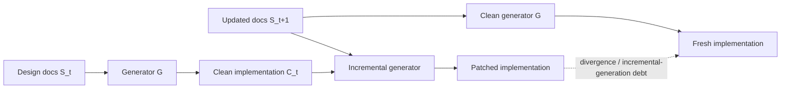
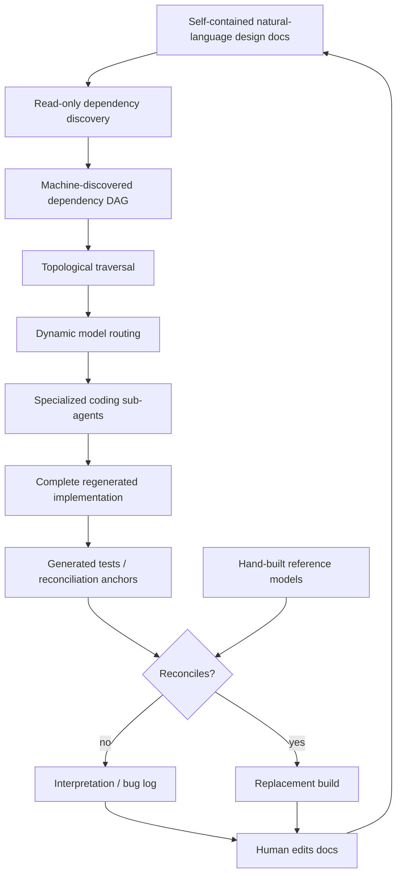
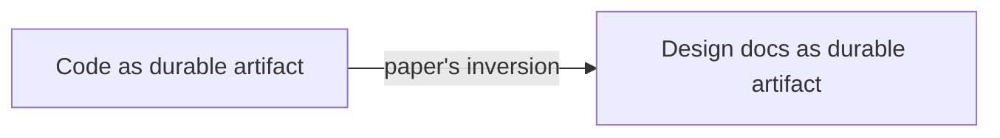
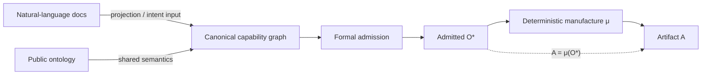
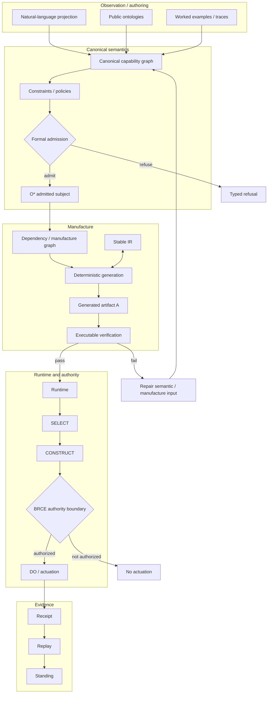
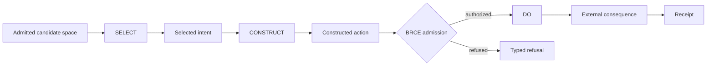
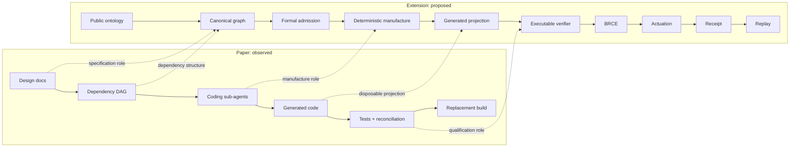
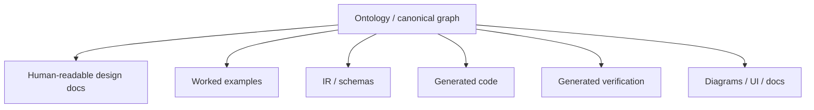
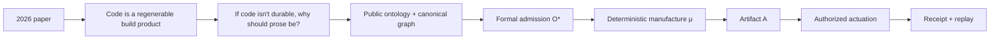

# Design Docs Aren't the Source Code Either

> Playground case study: extending the regeneration architecture in **Design Docs Are All You Need: An AI-native Machine-Learning Performance Tool** into an ontology-first, admitted, receipted manufacture graph.

## Source and evidence boundary

**Observed source:** Samuel Kushnir, Kimia Noorbakhsh, Kavya Sreedhar, Liqun Cheng, Ming Liu, Parthasarathy Ranganathan, Mohammad Alizadeh, Fred Kjolstad, and Suvinay Subramanian, *Design Docs Are All You Need: An AI-native Machine-Learning Performance Tool*, arXiv:2609.05364, submitted September 4, 2026.

Source: https://arxiv.org/abs/2609.05364

The paper reports that SMART treats natural-language design documents as the durable artifact and regenerated code as a build product. Its repository is organized as a machine-discovered dependency DAG; an orchestrator traverses the DAG in topological order and delegates self-contained documents to coding sub-agents. The paper also reports dynamic model routing, worked examples as semantic constraints, reconciliation against hand-built reference models, a minimal symbolic IR, approximately 50 design documents / 9,000 lines of specification prose, and clean-slate regeneration in roughly 1.5–3 hours at around $100 of Claude Code API cost.

Everything below the **Extension boundary** is a proposed Chatman/ggen architecture. It is not attributed to the paper.

---

## 1. The paper's inversion

The paper attacks incremental-generation debt by changing what is durable.

For specification `S_t` and generator `G`, clean generation is:

`C_t = G(S_t)`

Incremental maintenance instead feeds yesterday's implementation back into manufacture:

`C_(t+1) = G(S_(t+1), C_t)`

The paper defines the resulting debt as the distance between that incrementally patched implementation and the implementation that would have been generated from the current specification alone.

The architectural response is deliberately destructive: **regenerate instead of maintaining the generated implementation**.

---

## 2. Observed SMART manufacture graph

This is a compact projection of the architecture described by the paper.

### What this independently validates

The paper provides 2026 research evidence for several architectural moves that also appear in deterministic software-manufacture work:

- **Context bounding:** one self-contained specification unit per generation step.
- **Graph structure:** generation order is a dependency DAG, not a flat prompt sequence.
- **Model routing:** stronger models can be reserved for foundational abstractions while cheaper models handle downstream units.
- **Examples as semantic constraints:** concrete traces reduce ambiguity that prose alone leaves unresolved.
- **Regeneration over maintenance:** generated implementation is disposable.
- **Stable IR:** a small symbolic intermediate representation absorbs implementation churn.
- **Reconciliation before replacement:** regenerated output must agree with reference behavior before becoming the build.

These are overlaps, not claims of architectural equivalence.

---

## 3. The remaining source-of-truth question

The paper moves durability one level upstream:

But the paper itself gives the reason to ask whether this is the terminal abstraction. It states that a concrete execution trace can pin down semantics that prose leaves ambiguous.

That creates the next question:

> **If code is not the durable artifact, why should prose be?**

Natural-language design docs are dramatically better than incrementally patched code for regeneration, but prose can still carry ambiguity, duplicated concepts, unstated constraints, and authority that is difficult to inspect mechanically.

---

# Extension boundary

Everything from here forward is a proposed extension, not a description of SMART.

## 4. Move durability from prose to admitted semantics

The proposed inversion is:

The durable subject is no longer prose or implementation. It is the **admitted semantic object** `O*` from which lawful projections can be manufactured.

### Chatman Equation

`A = μ(O*)`

Where:

- `O` is observed/raw information and may be partial or stale.
- `O*` is admitted, aligned, grounded, and bounded semantics.
- `μ` is lawful manufacture.
- `A` is a generated artifact whose standing derives from the admitted input and manufacture path.

In this framing, the paper's design documents are a powerful approximation of `O*`; the extension makes admission explicit rather than asking prose to carry the entire semantic burden.

---

## 5. Full graph: from public semantics to replayable consequence

The critical addition after generation is **authority**. A generated artifact may be valid without being authorized to cause an external consequence.

Generation is not `DO`.

---

## 6. SELECT, CONSTRUCT, DO

This separation prevents a model, planner, generated program, proof, semantic derivation, or hook from inheriting ambient execution authority merely because it can produce a plausible action.

**Zero unreceipted actuation:** the only lawful path to `DO` crosses the authority boundary and emits a receipt.

---

## 7. Paper → extension correspondence

The dashed arrows are **role correspondences**, not equivalence proofs.

---

## 8. Preserve what the paper gets right

Chesterton's Fence applies. The extension should not discard design docs, worked examples, model routing, the dependency DAG, reconciliation, or the minimal symbolic IR merely because a more formal semantic substrate is introduced.

Instead:

Design docs remain valuable; they become **projections and authoring interfaces over shared semantics**, rather than the sole root of truth.

---

## 9. Falsifiers

This extension should be rejected or narrowed if evidence shows any of the following:

1. A public/canonical ontology cannot represent the required semantics without more ambiguity or maintenance burden than the design docs it replaces.
2. Formal admission fails to preserve valid reversible design possibilities and instead creates premature rigidity.
3. Regeneration from admitted semantics cannot reproduce required behavior at least as reliably as regeneration from the design-doc DAG.
4. The ontology → graph → admission → manufacture correspondence cannot be replayed deterministically enough to establish artifact identity and provenance.
5. BRCE/receipt machinery adds authority ceremony where no external consequence or privileged actuation exists.

One failed edge is topology, not proof that the entire graph is invalid; each falsifier should be scoped to the boundary it actually tests.

---

## 10. Compact thesis

**Design Docs Are All You Need** independently strengthens the premise that implementation code can be treated as a disposable projection. The next research question is whether natural-language specification should itself be a projection over a more durable, machine-admitted semantic graph.

The proposed endpoint is not “AI writes all the code.” It is:

**public semantics → admitted graph → lawful manufacture → verified runtime → authorized consequence → receipt → replay**
